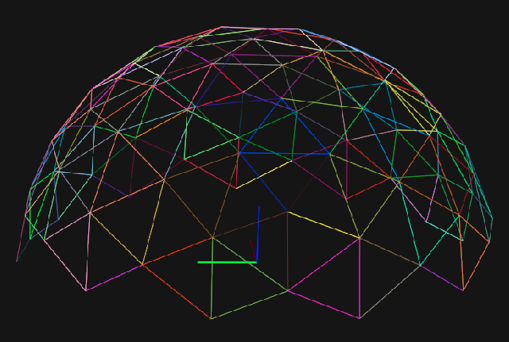
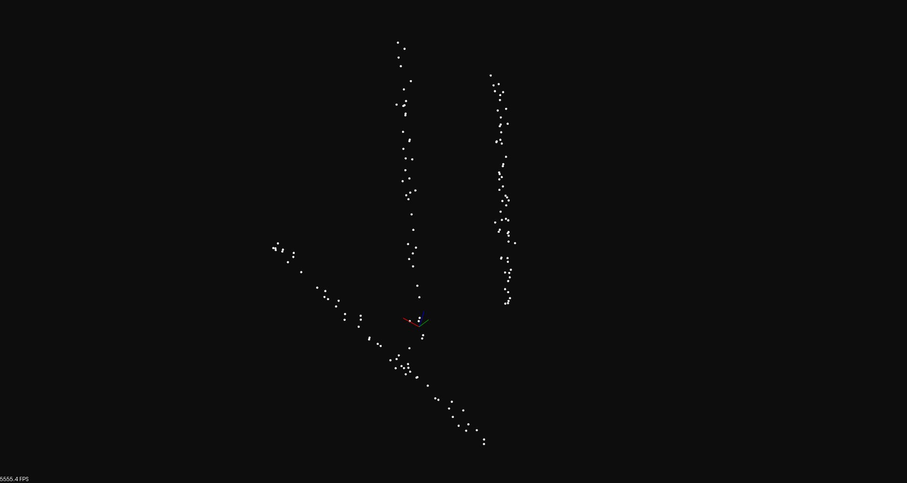
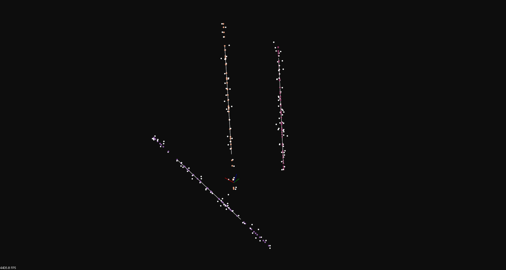

# 📝 Hough Transform based 3D Line Detection
***
- This is the reimplementation of [Iterative Hough Transform for Line Detection in 3D Point Clouds](https://www.ipol.im/pub/art/2017/208/). This implementation organizes the algorithm into a library that can be used in plug-and-play style easily.

- Image of semihemisphere whose vertices show directions for the method's parameter space discretization



## :tada: TODO
***

- [x] Implementation of [Iterative Hough Transform for Line Detection in 3D Point Clouds](https://www.ipol.im/pub/art/2017/208/)
- [x] Test on pointcloud data

## 🎛  Dependencies
***

```bash
sudo apt-get install \
    libpcl-dev \
```

## 🔨 How to Build ##
***

```bash
make default # to build the library
make apps # to build the examples
```

## :running: How to Run ##
***

- draw semihemisphere

```bash
# ./build/examples/draw_sphere_app [number/of/subdivision]
# eg: ./build/examples/draw_sphere_app 0
# number of subdivision: 0 -> 5
```

- test 3d line detection example

```bash
# ./build/examples/3d_line_detection_app [path/to/pcd/file] [use/default/setting/yes:1/no:0] [num/range/bin] [sphere/granularity] [min/num/vote] [distance/to/line/thresh]
# eg: ./build/examples/3d_line_detection_app ./data/test_cloud.pcd 0 64 4 10 0.2
# note that if you increase number of accumulator cells, you need to reduce the threshold of minimum vote number
```

<table>
    <tr>
        <td>original pointcloud</td>
        <td>detected 3d lines</td>
    </tr>
    <tr>
        <td valign="top"></td>
        <td valign="top"></td>
    </tr>
</table>

## :gem: References ##
***

- [Iterative Hough Transform for Line Detection in 3D Point Clouds](https://github.com/cdalitz/hough-3d-lines). [BSD LICENSE](https://github.com/cdalitz/hough-3d-lines/blob/master/LICENSE)
